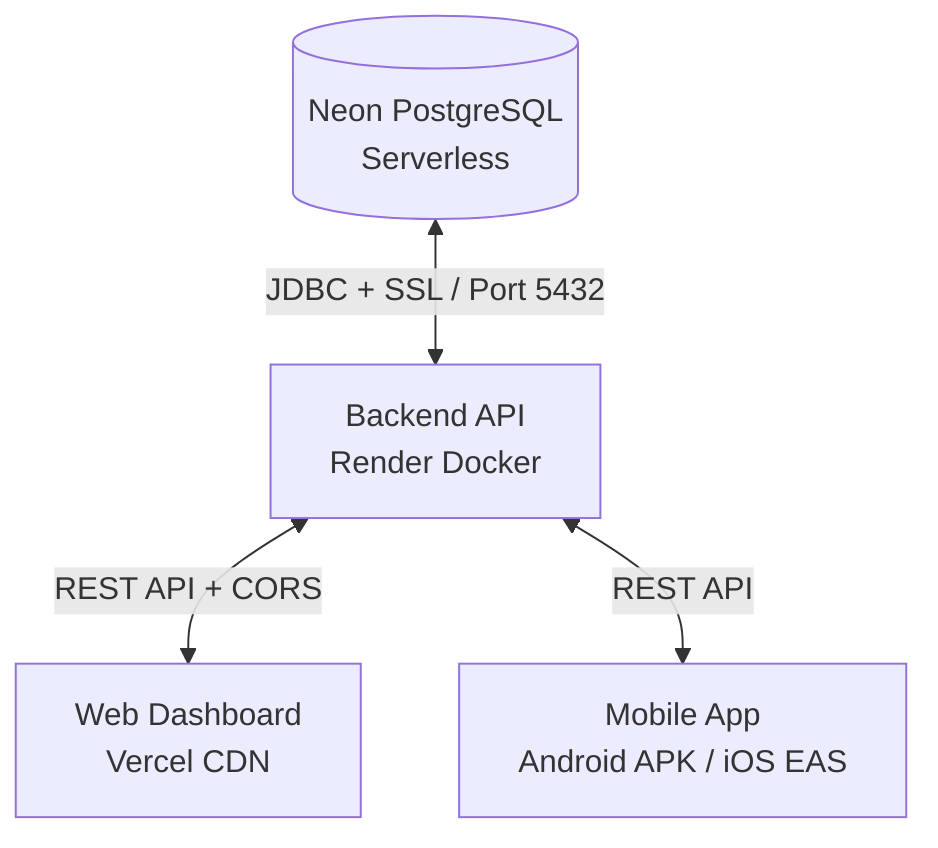

# Kimbia Cloud Deployment Guide

This document covers the complete end-to-end deployment setup for the **Kimbia** platform across all components:
- **Database**: Neon (Serverless PostgreSQL)
- **Backend API**: Render (Spring Boot 4 - stable / Java 21 via Docker)
- **Web Dashboard**: Vercel (React 19 / Vite SPA)
- **Mobile App**: Expo Application Services / EAS (Android APK & iOS)

---

## Architecture Overview



---

## 1. Database Deployment (Neon PostgreSQL)

Neon provides serverless PostgreSQL with auto-scaling and connection branching.

### Steps:
1. Go to [neon.tech](https://neon.tech) and create a project (e.g. `kimbia-db`).
2. Obtain your database connection string from the dashboard. It will look like:
   ```text
   postgresql://neondb_owner:<password>@ep-curly-base-zani8k86-pooler.c-2.eu-west-2.aws.neon.tech/neondb?sslmode=require&channel_binding=require
   ```
3. For Spring Boot (JDBC), convert this into:
   * **JDBC URL**:
     ```text
     jdbc:postgresql://ep-curly-base-zani8k86-pooler.c-2.eu-west-2.aws.neon.tech:5432/neondb?sslmode=require&prepareThreshold=0
     ```
     *(Note: If using the direct endpoint without `-pooler`, remove `&prepareThreshold=0`)*
   * **Username**: `neondb_owner`
   * **Password**: `<your-neon-password>`

### Connection Pool Configuration (`application.properties`):
Neon auto-suspends compute after 5 minutes of inactivity on the free tier. The following HikariCP settings ensure smooth reconnection:
```properties
spring.datasource.hikari.maximum-pool-size=5
spring.datasource.hikari.minimum-idle=1
spring.datasource.hikari.idle-timeout=300000
spring.datasource.hikari.max-lifetime=600000
spring.datasource.hikari.connection-timeout=30000
```

---

## 2. Backend Deployment (Render)

The backend is built with Spring Boot 4 and Java 21. Since Render does not provide a native Java buildpack, it runs inside a multi-stage Docker container.

### Files Configured:
- **`backend/Dockerfile`**:
  - Build stage: `maven:3.9-eclipse-temurin-21-alpine`
  - Runtime stage: `eclipse-temurin:21-jre-alpine`
  - JVM Flags: `-XX:+UseSerialGC -XX:MaxRAMPercentage=75.0 -Xss256k` (optimized to avoid OOM crashes on Render's 512MB RAM free tier)
- **`backend/.dockerignore`**: Excludes `target/`, `uploads/`, and IDE files.
- **`backend/src/main/resources/application.properties`**: Reads configuration dynamically from environment variables with safe local defaults.

### Render Dashboard Steps:
1. Log in to [dashboard.render.com](https://dashboard.render.com).
2. Click **New +** > **Web Service**.
3. Connect your GitHub repository (`IthielKyama/kimbia`).
4. Configure service settings:
   - **Name**: `kimbia-backend`
   - **Root Directory**: `backend` *(Required: do not leave blank in this monorepo)*
   - **Runtime**: `Docker`
   - **Instance Type**: `Free` (or `Starter` $7/mo for zero sleep / always-on)
   - **Health Check Path**: `/health` (or `/api/health`)
5. Under **Environment Variables**, add:

| Key | Value | Description |
| :--- | :--- | :--- |
| `PORT` | `10000` | Port Render routes external traffic to |
| `SPRING_DATASOURCE_URL` | `jdbc:postgresql://<neon-host>:5432/neondb?sslmode=require&prepareThreshold=0` | Neon JDBC connection string |
| `SPRING_DATASOURCE_USERNAME` | `neondb_owner` | Neon database username |
| `SPRING_DATASOURCE_PASSWORD` | `<your-neon-password>` | Neon database password |
| `SPRING_JPA_HIBERNATE_DDL_AUTO` | `update` | Automatically creates/updates DB schema |
| `JWT_SECRET` | `<64-character-hex-secret>` | Secret key for signing auth tokens |
| `APP_BASE_URL` | `https://kimbia-backend.onrender.com` | Your public Render URL (for file upload links) |

6. Click **Deploy Web Service**.
7. Once healthy, test the public endpoints:
   - Health check: `https://<your-app>.onrender.com/health`
   - Public races API: `https://<your-app>.onrender.com/api/races`

---

## 3. Web Dashboard Deployment (Vercel)

The web dashboard is built with React 19, Vite, and React Router.

### Files Configured:
- **`web/vercel.json`**:
  Configures Single-Page Application (SPA) client-side rewrite rules so refreshing sub-routes (e.g. `/races`, `/login`) redirects to `index.html` instead of returning 404:
  ```json
  {
    "rewrites": [
      {
        "source": "/(.*)",
        "destination": "/index.html"
      }
    ]
  }
  ```
  *(Saved as UTF-8 without BOM to satisfy Vercel's strict JSON parser)*.

### Vercel Dashboard Steps:
1. Log in to [vercel.com/dashboard](https://vercel.com/dashboard).
2. Click **Add New...** > **Project**.
3. Import your GitHub repository (`IthielKyama/kimbia`).
4. In **Project Settings**:
   - **Framework Preset**: `Vite`
   - **Root Directory**: Click Edit and select `web`
   - **Build Command**: `npm run build`
   - **Output Directory**: `dist`
5. Under **Environment Variables**, add:

| Key | Value | Environments |
| :--- | :--- | :--- |
| `VITE_API_URL` | `https://kimbia-backend.onrender.com` | Production, Preview, Development |

*(Ensure there is no trailing slash on the backend URL)*.

6. Click **Deploy**. Vercel will build and assign an instant production URL.

---

## 4. Mobile App Deployment (Expo / EAS Build)

The mobile app is built with React Native and Expo. It compiles into a standalone Android `.apk` via Expo Application Services (EAS).

### Files Configured:
- **`mobile/eas.json`**:
  - Configures the `preview` profile with `"buildType": "apk"` so EAS generates a direct-install APK instead of a Google Play bundle.
  - Sets `"appVersionSource": "local"` to manage versioning from `app.json`.
- **`mobile/app.json`**:
  - App Name: `"Kimbia"`
  - Package ID: `"com.kimbia.app"`
  - Version: `"1.0.0"` with Android `versionCode: 1`
  - Splash Background: `"#0B0F19"` (eliminates white-screen launch flash)
- **`mobile/.env`**:
  ```env
  EXPO_PUBLIC_API_URL=https://kimbia-backend.onrender.com
  ```

### Build Steps:
1. Open your terminal in the `mobile` directory:
   ```bash
   cd mobile
   ```
2. Run the EAS build command:
   ```bash
   npx eas-cli build -p android --profile preview
   ```
3. During the build:
   - Log in to your free Expo account when prompted.
   - When asked *"Generate a new Android Keystore?"*, select **Yes** (EAS stores your signing credentials securely in the cloud).
4. When compilation finishes (~5–10 minutes), EAS output provides:
   - A **direct HTTPS download URL** to download the `.apk` file.
   - A **terminal QR code** you can scan with your Android phone to install directly.
   - An **Expo Dashboard build link** to share the installer with testers.

---